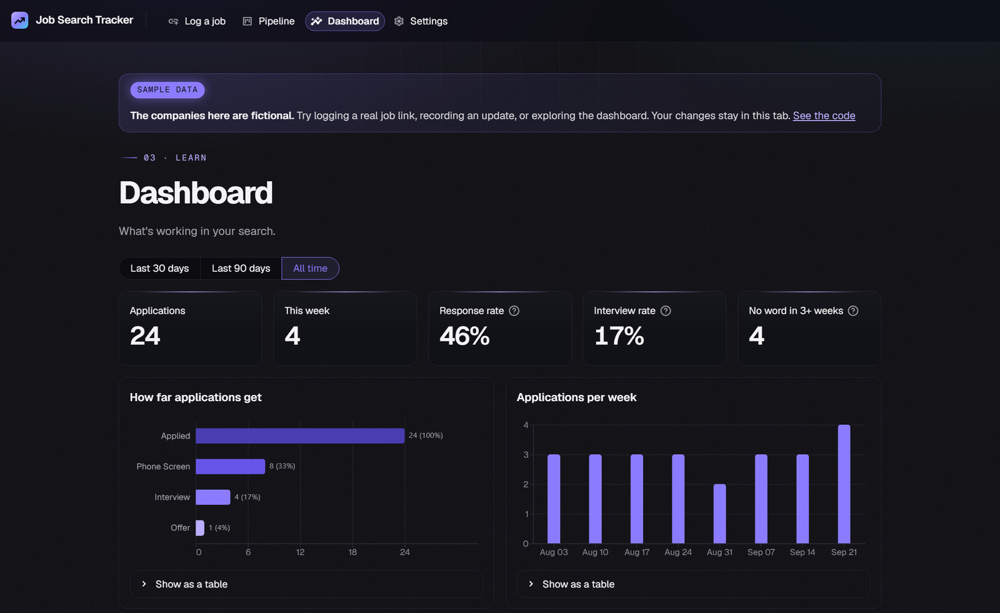
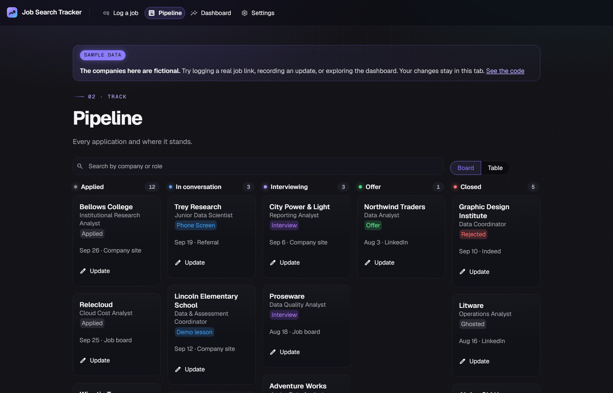

<h1 align="center">Job Search Tracker</h1>

  Log a job from its link, track every reply, and see what's actually working in your search. 
  No spreadsheets, no SQL, and it works for any field.

  

  
  
  
  
  

Paste a job link and the company, role, location, pay and description fill themselves in. Move applications across a board as replies come in, and the dashboard shows which resume versions and channels actually get responses. You name your own resume versions, channels and hiring stages, so it fits a nurse's or a teacher's search as well as an analyst's.

The **[live demo](https://mojoboy-job-tracker.streamlit.app)** runs on made-up sample data (the companies are fictional), and anything you change stays in your browser tab.

## Start it

1. You need Python 3.10+ and MySQL 8.
2. Double-click `start.bat`. The first run sets up the tracker's own Python environment (a `.venv` folder, a few minutes), then the tracker opens in your browser.
3. On the first screen, enter your MySQL user and password, and a Claude API key if you have one. They're saved in `.env` on your computer; the tracker creates its tables for you.

## What's in it

| Page | What it does |
|---|---|
| **Log a job** | Paste a job link; the company, role, location, pay and full description fill in. Pick where you found it and which resume you sent, then save. It warns you if you already logged that job. |
| **Pipeline** | A board with Applied, In conversation, Interviewing, Offer and Closed columns, or a table. Open any application to record a phone screen, interview, offer or rejection, or a stage of your own like "Skills test". |
| **Dashboard** | Response and interview rates, how far applications get, applications per week, which resumes and channels get replies, and who's gone quiet for three weeks, for the last 30 or 90 days or all time. |
| **Settings** | Connection and API key, resume versions, import from a spreadsheet (CSV), export, and a **Log this job** browser bookmark. |

**How links are read:** Greenhouse, LinkedIn and Oracle job pages are read through their public job data. Most other job sites (Workday, Lever, Ashby, iCIMS, SmartRecruiters and many company sites) include standard job data in the page. With a Claude API key, anything still missing (usually the industry) is filled in from the description. Sites that block automatic reading, such as Indeed, get a "paste the description instead" message. Only public web addresses are fetched.

## Command line

| To do this | Run |
|---|---|
| Log a job you applied to | `python job_logger.py` |
| Record a phone screen, interview, offer or rejection | `python job_logger.py status` |
| Add many applications from a spreadsheet saved as CSV | `python job_logger.py import my_jobs.csv` |
| Save everything to a spreadsheet | `python job_logger.py export` |
| Check the database and apply one-time updates | `python job_logger.py setup` |

## Analysis in MySQL Workbench or Tableau

`queries.sql` has response rate by resume version, days to first response, the funnel, weekly volume, the ghost list, channel performance, and every application's current status. A "response" is any status except Applied, Viewed, Ghosted and Withdrawn; the app uses the same rule.

## Code

| File | Role |
|---|---|
| `app.py` | The Streamlit web app |
| `demo.py`, `sample_data.py` | The public demo: the same app on made-up data, one private copy per browser tab |
| `capture.py` | Reads job links: public job data, schema.org JobPosting, then Claude for the gaps |
| `analytics.py` | Dashboard numbers, computed with pandas |
| `job_logger.py` | Database access, schema updates, import/export, and the command line |
| `tests/` | `python -m unittest discover -s tests -v` (in-memory database, no network, no API calls) |
