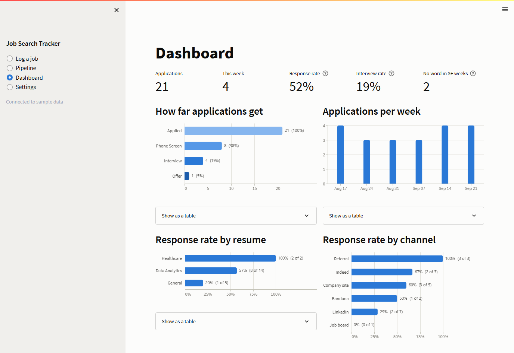

# Job Search Tracker

Track job applications and what happens to them without writing SQL. Paste a job link and the details fill themselves in, update statuses from a dropdown, and see which resumes and channels actually get replies. It works for any field: you name your own resume versions, channels and stages.

## Start it

1. You need Python 3.10+ and MySQL 8.
2. Double-click `start.bat`. The first run installs what it needs, then the tracker opens in your browser. (Or run `pip install -r requirements.txt`, then `streamlit run app.py`.)
3. On the first screen, enter your MySQL user and password, and a Claude API key if you have one. They're saved in `.env` on your computer; the tracker creates its tables for you.

## What's in it

| Page | What it does |
|---|---|
| **Log a job** | Paste a job link; the company, role, location, pay and full description fill in. Pick where you found it and which resume you sent, then save. It warns you if you already logged that job. |
| **Pipeline** | Every application with its current status. Record a phone screen, interview, offer or rejection, or a stage of your own like "Skills test". |
| **Dashboard** | Response and interview rates, how far applications get, applications per week, which resumes and channels get replies, and who's gone quiet for three weeks. |
| **Settings** | Connection and API key, resume versions, import from a spreadsheet (CSV), export, and a **Log this job** browser bookmark. |

**How links are read:** Greenhouse, LinkedIn and Oracle job pages are read through their public job data. Most other job sites (Workday, Lever, Ashby, iCIMS, SmartRecruiters and many company sites) include standard job data in the page. With a Claude API key, anything still missing (usually the industry) is filled in from the description. Sites that block automatic reading, such as Indeed, get a "paste the description instead" message.

## Command line

| To do this | Run |
|---|---|
| Log a job you applied to | `python job_logger.py` |
| Record a phone screen, interview, offer or rejection | `python job_logger.py status` |
| Add many applications from a spreadsheet saved as CSV | `python job_logger.py import my_jobs.csv` |
| Save everything to a spreadsheet | `python job_logger.py export` |
| Check the database and apply one-time updates | `python job_logger.py setup` |

## Analysis in MySQL Workbench or Tableau

`queries.sql` has response rate by resume version, days to first response, the funnel, weekly volume, the ghost list, channel performance, and every application's current status. A "response" is any status except Applied, Viewed, Ghosted and Withdrawn; the app uses the same rule.

## Code

| File | Role |
|---|---|
| `app.py` | The Streamlit web app |
| `capture.py` | Reads job links: public job data, schema.org JobPosting, then Claude for the gaps |
| `analytics.py` | Dashboard numbers, computed with pandas |
| `job_logger.py` | Database access, schema updates, import/export, and the command line |
| `tests/` | `python -m unittest discover -s tests -v` (in-memory database, no network, no API calls) |
